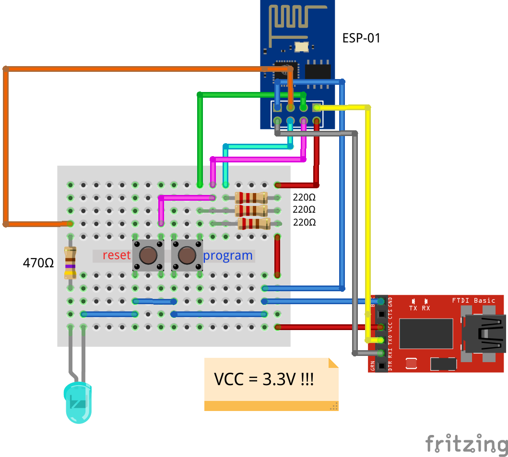

1. Чтобы добавить поддержку модуля esp8266(esp-01) в arduino ide:
    - В меню File -> Preferences в поле "Additional Boards Manager URLs" добавил строку http://arduino.esp8266.com/stable/package_esp8266com_index.json
    - В меню Tools -> Board: "..." -> Boards Manager... в поисковой строке вводим esp8266 и нажимаю кнопку install
    - Выбираем Generic ESP8266 Module в меню Tools -> Board: "..." -> ESP8266 Boards (2.7.4)
    
2. Мигание встроенным светодиодом для отладки:
    - По умолчанию в Tools -> Board: "..." -> ESP8266 Boards (2.7.4) -> Builtin Led: "2", но как оказалось что из-за этого не мигал встроенный светодиод на модуле esp-01. При исправлении Builtin Led: "2" на Builtin Led: "1" проблема решилась.
    - Код мигания встроенным светодиодом:
```c++
void setup() {
  pinMode(LED_BUILTIN, OUTPUT);
}

void loop() {
  digitalWrite(LED_BUILTIN, LOW);
  delay(500);
  digitalWrite(LED_BUILTIN, HIGH);
  delay(500);
}
```
3. Схема подключения модуля esp-01 и UART преобразователя:
<p></p>
